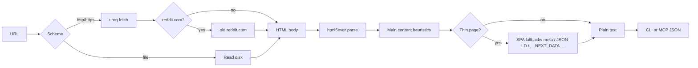

# tro-webpage-cli

**Turn documentation URLs into LLM-ready plain text without burning tokens on HTML.**

tro is a Rust CLI and MCP server that fetches a page over HTTP, extracts the readable article body, and prints title + text. Built for agents and humans reading Rust book chapters, API refs, and SSR docs in Cursor, not for rendering the web.

[](https://github.com/Cincinnatus101010/tro-webpage-cli/actions/workflows/ci.yml)
Rust 1.70+ · License: MIT

---

## The problem

LLMs and coding agents choke on raw HTML: tags, scripts, nav chrome, and megabytes of boilerplate. Pasting a doc page into context wastes tokens and hides the actual prose. Browser tools are heavy; `curl` still leaves you parsing markup by hand.

## What I built

A small fetch-and-extract pipeline with two interfaces (**CLI** and **MCP**) that returns clean text you can drop straight into a prompt.

| **Input**     | One or more `http://`, `https://`, or `file://` URLs |
| ------------- | ---------------------------------------------------- |
| **Output**    | Title + readable body text (optional `max_chars` cap) |
| **Parallelism** | Multiple URLs fetched concurrently via **rayon**   |
| **Agents**    | Cursor + Claude MCP: `read_url` and `read_urls`     |

**Example CLI run**

```bash
cargo install --path .
tro "https://doc.rust-lang.org/book/ch01-02-hello-world.html"
```

```
Hello, World! - The Rust Programming Language

Hello, World!
This is the template output…
```

**Parallel batch (JSON)**

```bash
tro --json --max-chars=60000 \
  "https://doc.rust-lang.org/std/primitive.str.html" \
  "https://doc.rust-lang.org/std/string/struct.String.html"
```

---

## Architecture



1. **Fetch**: Sync HTTP with gzip (`ureq`); `file://` for local paths; `www.reddit.com` rewritten to **`old.reddit.com`** (new Reddit serves a bot-check shell).
2. **Parse**: `html5ever` DOM; prefer `main`, `article`, `role=main`, and common doc class names.
3. **Hydrate thin shells**: If visible text is sparse, pull `og:` meta, JSON-LD, `__NEXT_DATA__`, and `<noscript>` (no JS execution).
4. **Return**: Title, normalized text, optional truncation with `[truncated]` marker.

---

## Highlights for reviewers

**Systems / Rust**

- Single crate, clear modules: `net` (fetch), `dom` (extract), `lib` (orchestration), `mcp` + `main` (interfaces)
- Release profile with **fat LTO**, `codegen-units = 1`, stripped binary tuned for shipped CLI performance
- **Rayon** parallelizes multi-URL work (I/O-bound), not inner DOM loops

**Agent integration**

- MCP stdio server (`tro-mcp`) with `read_url` and `read_urls`
- **Cursor** (`.cursor/mcp.json`) and **Claude Code** (`.mcp.json`) configs; rules in `.cursor/rules/docs.mdc` and `.claude/rules/docs.md`

**Extraction quality**

- Strips `script`, `style`, nav noise; keeps link text where useful
- Token cap via `--max-chars` / MCP `max_chars`
- Honest limits documented (SSR/docs yes; pure client-rendered SPAs may be empty)

**Quality**

- **13 automated tests**: unit URL rewrite + integration pipeline (DOM, HTTP mock, temp files)
- **`PageFactory`** / `HttpFactory` / `FileUrlFactory` in `tests/common/factory.rs`, no checked-in HTML fixtures
- GitHub Actions CI: `cargo test` on every push to `main`

---

## Tech stack

| Layer        | Tools                          |
| ------------ | ------------------------------ |
| Language     | Rust 2021                      |
| HTTP         | ureq (TLS + gzip)              |
| HTML         | html5ever, markup5ever_rcdom     |
| Parallelism  | rayon                          |
| MCP / JSON   | serde, serde_json              |
| Testing      | cargo test, httpmock, tempfile |

---

## Quick start

**Requirements:** Rust toolchain (`rustup`), `cargo`.

```bash
git clone https://github.com/Cincinnatus101010/tro-webpage-cli.git
cd tro-webpage-cli
cargo build --release
cargo install --path .   # installs tro + tro-mcp on PATH
```

### CLI

```bash
# One page
tro https://doc.rust-lang.org/book/

# JSON for scripting
tro --json https://doc.rust-lang.org/book/ch01-01-installation.html

# Cap tokens on huge pages
tro --max-chars=80000 "https://www.reddit.com/r/rust/comments/.../"

# Several URLs in parallel
tro --json URL1 URL2 URL3
```

### Cursor MCP

1. Open this repo in Cursor (`.cursor/mcp.json` is included).
2. Enable MCP server **tro** and reload.
3. Agents call **`read_url`** (one page) or **`read_urls`** (parallel batch, optional `max_chars`).

### Claude Code

1. Clone the repo and open it in Claude Code. **`.mcp.json`** at the repo root registers **tro** for the project ([MCP docs](https://code.claude.com/docs/en/mcp)).
2. Approve the server when prompted (`claude mcp list` shows pending servers).
3. Same tools as Cursor: **`read_url`**, **`read_urls`**. Agent guidance lives in **`CLAUDE.md`** and **`.claude/rules/docs.md`**.

Uses `cargo run --release --bin tro-mcp` via `${CLAUDE_PROJECT_DIR}`. For a global install instead:

```bash
cargo install --path .
claude mcp add tro -- tro-mcp
```

### Claude Desktop

1. Install the binary: `cargo install --path .` (puts **`tro-mcp`** on your `PATH`).
2. Open **Settings → Developer → Edit Config** ([config locations](https://code.claude.com/docs/en/mcp)).
3. Merge the **`tro`** entry from [`config/claude_desktop_config.example.json`](config/claude_desktop_config.example.json) into `claude_desktop_config.json`.
4. Restart Claude Desktop. You should see the **tro** tools in the connector/hammer menu.

### Library

```rust
use tro::{extract_url, extract_urls, ExtractOptions};

let page = tro::extract_url("https://doc.rust-lang.org/book/")?;
println!("{}: {} chars", page.title, page.text.len());
```

---

## Project structure

```
src/
  lib.rs       # extract_url, extract_urls, UrlPage
  main.rs      # tro CLI
  mcp.rs       # MCP stdio server
  net.rs       # HTTP / file fetch, Reddit rewrite
  dom/
    readable.rs  # HTML → text, main-content heuristics
    spa.rs       # Thin-page metadata fallbacks
tests/
  common/factory.rs   # PageFactory, HttpFactory, FileUrlFactory
  extract.rs          # Integration tests
.mcp.json              # Claude Code (project MCP)
.claude/rules/docs.md  # Claude Code doc-reading rules
.cursor/
  mcp.json
  rules/docs.mdc
config/
  claude_desktop_config.example.json
CLAUDE.md
```

---

## Testing

```bash
cargo test    # 13 tests, no network required
```

CI runs the full test suite on every push to `main`.

---

## Limits

| Topic | Behavior |
| ----- | -------- |
| Best results | SSR documentation (Rust book, MDN, API refs) |
| Reddit | `reddit.com` / `www.reddit.com` → `old.reddit.com` automatically |
| SPAs | No JS runtime; empty shells may stay empty unless meta/JSON-LD embeds text |
| Huge pages | Use `--max-chars` or MCP `max_chars` |

---

## License

MIT
