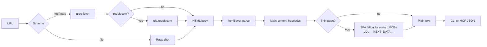

# tro-webpage-cli

Fetch documentation URLs and get LLM-ready plain text — without burning tokens on HTML.

tro is a Rust CLI and MCP server. It downloads a page, extracts the readable body, and returns title + text. Built for agents and humans reading Rust book chapters, API refs, and SSR docs in Cursor — not for rendering the web.

[](https://github.com/Cincinnatus101010/tro-webpage-cli/actions/workflows/ci.yml)

**Rust 1.70+** · **MIT**

## Contents

- [Quick start](#quick-start)
- [Usage](#usage)
- [How it works](#how-it-works)
- [Project layout](#project-layout)
- [Testing](#testing)
- [Limits](#limits)

---

## Quick start

**Requirements:** Rust toolchain (`rustup`), `cargo`.

```bash
git clone https://github.com/Cincinnatus101010/tro-webpage-cli.git
cd tro-webpage-cli
cargo install --path .   # installs tro + tro-mcp on PATH
```

Try it:

```bash
tro "https://doc.rust-lang.org/book/ch01-02-hello-world.html"
```

Example output:

```
Hello, World! - The Rust Programming Language

Hello, World!
This is the template output…
```

---

## Usage

### CLI

| Flag | Purpose |
| ---- | ------- |
| `--json` | Structured output for scripting |
| `--max-chars=N` | Cap body length (adds `[truncated]` when cut) |

```bash
# One page
tro https://doc.rust-lang.org/book/

# JSON
tro --json https://doc.rust-lang.org/book/ch01-01-installation.html

# Cap tokens on huge pages
tro --max-chars=80000 "https://www.reddit.com/r/rust/comments/.../"

# Several URLs in parallel
tro --json --max-chars=60000 URL1 URL2 URL3
```

**Input:** one or more `http://`, `https://`, or `file://` URLs.

### MCP (Cursor, Claude Code, Claude Desktop)

Two tools: **`read_url`** (one page) and **`read_urls`** (parallel batch, optional `max_chars`).

| Client | Setup |
| ------ | ----- |
| **Cursor** | Open this repo. Enable MCP server **tro** from `.cursor/mcp.json` and reload. Rules in `.cursor/rules/docs.mdc`. |
| **Claude Code** | Open this repo. **`.mcp.json`** registers **tro** ([MCP docs](https://code.claude.com/docs/en/mcp)). Approve when prompted (`claude mcp list`). Guidance in **`CLAUDE.md`** and **`.claude/rules/docs.md`**. |
| **Claude Desktop** | `cargo install --path .`, then merge the **`tro`** entry from [`config/claude_desktop_config.example.json`](config/claude_desktop_config.example.json) into your config ([locations](https://code.claude.com/docs/en/mcp)). Restart the app. |

Claude Code runs `cargo run --release --bin tro-mcp` via `${CLAUDE_PROJECT_DIR}`. For a global install:

```bash
cargo install --path .
claude mcp add tro -- tro-mcp
```

### Library

```rust
use tro::{extract_url, extract_urls, ExtractOptions};

let page = tro::extract_url("https://doc.rust-lang.org/book/")?;
println!("{}: {} chars", page.title, page.text.len());
```

---

## How it works



1. **Fetch** — Sync HTTP with gzip (`ureq`); `file://` for local paths; `reddit.com` / `www.reddit.com` rewritten to **`old.reddit.com`** (new Reddit serves a bot-check shell).
2. **Parse** — `html5ever` DOM; prefer `main`, `article`, `role=main`, and common doc class names. Strips `script`, `style`, and nav noise.
3. **Hydrate thin shells** — If visible text is sparse, pull `og:` meta, JSON-LD, `__NEXT_DATA__`, and `<noscript>` (no JS execution).
4. **Return** — Title, normalized text, optional truncation. Multiple URLs run concurrently via **rayon**.

**Stack:** Rust 2021 · ureq · html5ever · rayon · serde · MCP stdio (`tro-mcp`)

---

## Project layout

```
src/
  lib.rs       # extract_url, extract_urls, UrlPage
  main.rs      # tro CLI
  mcp.rs       # MCP stdio server
  net.rs       # HTTP / file fetch, Reddit rewrite
  dom/
    readable.rs  # HTML → text, main-content heuristics
    spa.rs       # Thin-page metadata fallbacks
tests/
  common/factory.rs   # PageFactory, HttpFactory, FileUrlFactory
  extract.rs          # Integration tests
.mcp.json              # Claude Code (project MCP)
.claude/rules/docs.md  # Claude Code doc-reading rules
.cursor/
  mcp.json
  rules/docs.mdc
config/
  claude_desktop_config.example.json
CLAUDE.md
```

---

## Testing

```bash
cargo test    # 13 tests, no network required
```

CI runs the full suite on every push to `main`. Tests use **`PageFactory`** / **`HttpFactory`** / **`FileUrlFactory`** in `tests/common/factory.rs` — no checked-in HTML fixtures.

---

## Limits

| Topic | Behavior |
| ----- | -------- |
| Best results | SSR documentation (Rust book, MDN, API refs) |
| Reddit | Auto-rewritten to `old.reddit.com` |
| SPAs | No JS runtime; empty shells may stay empty unless meta/JSON-LD embeds text |
| Huge pages | Use `--max-chars` or MCP `max_chars` |

---

## License

MIT
